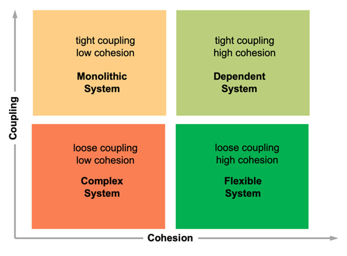

# Horizontal vs Vertical Architecture

Last updated: 2026-02-12

**Topics:** clean architecture, vertical slice architecture, bounded-contexts

## Two Approaches to Structuring Code

Horizontal and vertical architectures offer fundamentally different answers to how code should be organised. Each approach brings distinct trade-offs in maintainability, discoverability, and coupling.

[Horizontal architectures](./glossary.md#clean-architecture-concept) - such as Clean Architecture, Onion Architecture, and Hexagonal Architecture - separate code by technical layers, defining clear boundaries between domain logic, application services, and infrastructure concerns. [Vertical Slice Architecture](./glossary.md#vertical-slice-architecture-pattern) (VSA), on the other hand, groups all layers for a single feature or [bounded context](./glossary.md#bounded-contexts-domain-driven-design) together. 

Consider a modern website: you could write distinct HTML, CSS, and JavaScript files, separated by technology boundaries, or you could group everything related to a single component together in one file (as modern frameworks like React or Vue encourage). The distinction is **high cohesion** _within technology_ versus _around features_.

Assuming clear modular boundaries and loose coupling between slices, VSA seemed attractive due to its promise of improved discoverability, understandability, and flexibility.



## Friction Points in Practice

As my team attempted to adopt VSA within our microservices, similar questions kept recurring, each with its own challenges.

Despite promising easier onboarding, code still felt complex and confusing. Responsibilities remained mixed, with functions handling data modelling, business logic, and persistence all at once. I began experimenting with a hybrid approach: group by features first, then separate into well-defined layers within each slice so that functions and files had clear responsibilities. Unfortunately, slice boundaries were often blurred, and finding the right granularity proved elusive.

Consider a microservice responsible for running promotions. We sliced by "managing promotional campaigns" and "users making claims" - but both features required SQL queries to look up a campaign. If we opted for code replication, we risked lower maintainability: making the same changes multiple times, and potential for inconsistent behaviour. If we extracted the code into a [shared kernel](./glossary.md#shared-kernel-domain-driven-design), we risked creating a catch-all dumping ground for anything that didn't neatly fit into a single slice.

Horizontal architectures, by comparison, appeared to group wildly unrelated code together and require excessive directory nesting. I'm no **Java** developer, but experiencing this monstrosity ([source](https://levelup.gitconnected.com/leveraging-hexagonal-architectures-with-vertical-slice-architecture-and-feature-toggles-a308a48641b3)) on a daily basis may well have lead to an accelerated career change, retreating to grueling manual labour work on a remote farm, somewhere far away from modern civilization and technology:

```
my-project/
│
├── api/
│   ├── src/
│   │   └── main/
│   │       └── java/
│   │           └── com/
│   │               └── example/
│   │                   ├── feature1/
│   │                   │   └── api/
│   │                   │       └── Feature1Controller.java
│   │                   └── feature2/
│   │                       └── api/
│   │                           └── Feature2Controller.java
│   └── pom.xml
│
├── domain/
│   ├── src/
│   │   └── main/
│   │       └── java/
│   │           └── com/
│   │               └── example/
│   │                   └── feature1/
│   │                   │   └── domain/
│   │                   │       ├── model/
│   │                   │       ├── repository/
│   │                   │       │   └── Feature1Repository.java
│   │                   │       └── service/
│   │                   │           ├── impl
│   │                   │           │   └── Feature1ServiceImpl.java
│   │                   │           └── Feature1Service.java
│   │                   └── feature2/
│   │                       └── domain/
│   │                           ├── model/
│   │                           ├── repository/
│   │                           │   └── Feature2Repository.java
│   │                           └── service/
│   │                               ├── impl
│   │                               │   └── Feature2ServiceImpl.java
│   │                               └── Feature2Service.java
│   └── pom.xml
│
├── launcher/
│   ├── src/
│   │   └── main/
│   │       └── java/
│   │           └── com/
│   │               └── example/
│   │                   └── configuration/
│   │                       ├── Feature1Configuration.java
│   │                       └── Feature2Configuration.java
│   └── pom.xml
│
├── persistence/
│   ├── src/
│   │   └── main/
│   │       └── java/
│   │           └── com/
│   │               └── example/
│   │                   ├── feature1/
│   │                   │   └── data/
│   │                   │       └── repository/
│   │                   │           └── impl
│   │                   │               └── Feature1RepositoryImpl.java
│   │                   └── feature2/
│   │                       └── data/
│   │                           └── repository/
│   │                               └── impl
│   │                                   └── Feature1RepositoryImpl.java
│   └── pom.xml
│
└── pom.xml
```

## Reframing the Question

Taking a step back, I asked myself: what _is_ a suitable bounded context for a slice? In [Learning Domain-Driven Design](https://www.oreilly.com/library/view/learning-domain-driven-design/9781098100124/), Vlad Khononov discusses how you can drill down into more specific bounded contexts indefinitely, but at a certain point the subdivision stops being valuable. Perhaps my issue wasn't with VSA itself, but with choosing the wrong level of granularity.

What if we used horizontal architecture patterns as the primary strategy _within_ a microservice, while still organising by vertical slices at the service level? After all, well-designed microservices are themselves bounded contexts - each service encapsulates a distinct business capability or subdomain.

This reframing was liberating. Rather than treating horizontal and vertical architectures as competing approaches, I could use them at different scales:

- **Between services:** Vertical slicing, where each microservice represents a complete feature or bounded context
- **Within services:** Horizontal layering, where clean architectural boundaries separate domain logic from infrastructure concerns

## Benefits of the Hybrid Approach

This strategy provides several advantages:

**Clearer responsibilities:** Within each service, the [domain layer](./glossary.md#domain-layer-clean-architecture), [application layer](./glossary.md#application-layer-clean-architecture), and [interface adapters](./glossary.md#interface-adapters-layer-clean-architecture) each have well-defined purposes. Functions no longer muddle data access, business rules, and HTTP concerns.

**Reduced coupling:** The [dependency inversion principle](./glossary.md#dependency-inversion-principle-solid) enforced by horizontal architectures means the domain remains independent of external frameworks and infrastructure. Changes to databases or web frameworks stay contained.

**Discoverability at scale:** When each microservice is a vertical slice of the overall system, you gain the discoverability benefits of VSA. Within each service, horizontal layers provide clear navigation: "This is domain logic, this is application orchestration, this is infrastructure."

**Manageable shared code:** When multiple features within a service need similar functionality, horizontal layers provide natural places for it. Repository implementations live in the adapters layer. Domain utilities live in the domain layer. No need for awkward "shared" or "common" directories that blur boundaries.

## Conclusion

Horizontal and vertical architectures aren't mutually exclusive. By using vertical slicing at the service boundary and horizontal layering within services, we can achieve both the modularity of VSA and the clear separation of concerns that makes horizontal architectures valuable.

The key insight is recognising that architecture decisions don't need to be binary - sometimes the right answer is "both, at different scales."

## Further Reading and Resources

- [Leveraging Hexagonal Architectures with Vertical Slice Architecture and Feature Toggles](https://levelup.gitconnected.com/leveraging-hexagonal-architectures-with-vertical-slice-architecture-and-feature-toggles-a308a48641b3) - explores combining both approaches
- [Vertical Slice Architecture](https://jimmybogard.com/vertical-slice-architecture/) by Jimmy Bogard - foundational article on VSA
- [The Clean Architecture](https://blog.cleancoder.com/uncle-bob/2012/08/13/the-clean-architecture.html) by Robert C. Martin - the original Clean Architecture post
- [Learning Domain-Driven Design: Aligning Software Architecture and Business Strategy](https://www.oreilly.com/library/view/learning-domain-driven-design/9781098100124/) by Vlad Khononov (book) - comprehensive guide to DDD concepts including bounded contexts
- [Clean Architecture: A Craftsman's Guide to Software Structure and Design](https://www.oreilly.com/library/view/clean-architecture-a/9780134494272/) by Robert C. Martin (book) - in-depth exploration of layered architecture patterns

## Glossary terms in this post

- [Clean Architecture](./glossary.md#clean-architecture)
- [Vertical Slice Architecture](./glossary.md#vertical-slice-architecture)
- [Bounded contexts](./glossary.md#bounded-contexts)
- [Shared kernel](./glossary.md#shared-kernel-domain-driven-design)
- [Domain layer](./glossary.md#domain-layer)
- [Application layer](./glossary.md#application-layer)
- [Interface adapters layer](./glossary.md#interface-adapters-layer)
- [Dependency inversion principle](./glossary.md#dependency-inversion)