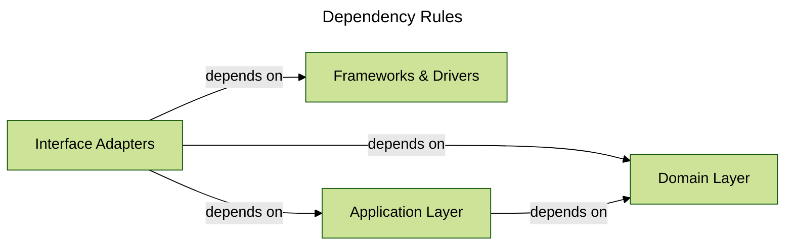

# Clean Architecture: A High-Level Map

Last updated 2025-12-09

**Themes:** clean architecture, layered architecture, dependency rules, separation of concerns, software design

In this post, I'll step back from the introduction and give you a high-level map of the Clean Architecture approach I'm using for new services in this monorepo and in other real-world TypeScript services. We'll look at the four layers, focusing on the three innermost layers which influence our system architecture — domain, use-cases and interface adapters — and establish the dependency rules that hold everything together. This is the foundation we'll build on in the rest of the series.

---

## Series Navigation
- [Introduction](./01-introduction.md)
- **[Architecture Overview](./02-architecture-overview.md)** (current)
- [The Domain Layer](./03-domain-layer.md)
- [The Application Layer](./04-application-layer.md)
- [The Interface Adapter Layer](./05-interface-adapters-layer.md)
- [Ports, Adapters, and Dependency Inversion](./06-ports-and-adapters.md)

---

## The Four Layers

[Clean Architecture](../glossary.md#clean-architecture) organises code into concentric layers, with dependencies pointing inward towards the core business logic. In the original diagram there are _four_ rings (Entities, Use Cases, Interface Adapters, and Frameworks & Drivers).

In the services I'm building, I mostly talk about three innermost layers in the codebase, and map those rings as follows:

- **Domain** ↔ Entities
- **Application** ↔ Use Cases
- **Adapters** ↔ Interface Adapters

Frameworks and drivers still exist, but in this monorepo (and similar codebases) they usually show up as third-party libraries and runtime/platform concerns rather than as a separate directory.

### Domain

The innermost layer. This is where the business rules, models, and invariants live. Domain code is pure: it doesn't know about databases, HTTP frameworks, or any other infrastructure concerns. It only depends on itself.

### Application

The orchestration layer. Application code coordinates domain logic to fulfill use-cases. It defines what the service does, without knowing how infrastructure details are implemented. This layer depends on the domain layer, but not on interface adapters.

### Interface Adapters

The outermost layer in the codebase _we write_ for our service. This is where our code meets the outside world: HTTP endpoints, databases, message queues, external APIs, and so on. Adapter code depends on both the application and domain layers, implementing the contracts those layers define.

---

## Dependency Rules

The key principle behind Clean Architecture is that **dependencies point inward**. Outer layers can depend on inner layers, but inner layers never depend on outer layers. This keeps the core business logic insulated from volatile infrastructure details.

Another way to put this: the more business-specific a piece of code is, the less it should know about frameworks, drivers, and other technical details at the edge.

Here's how that plays out in practice:

### Domain Layer Dependencies

The domain layer can only import from other domain code. It has zero dependencies on application, interface adapter or frameworks & drivers.

This restriction keeps domain logic pure and portable. If you need to change databases, switch HTTP frameworks, or even port the service to a different language, the domain layer shouldn't need to change.

### Application Layer Dependencies

The application layer can import from:
- The application layer itself (other services*, DTOs, application errors)
- The domain layer (models, domain logic, domain errors)

It **cannot** import from interface adapters or frameworks & drivers. When the application layer needs infrastructure (for example, to persist data or call an external API), it expresses that need through an interface (a "port"), which interface adapters will implement. We'll discuss this in more detail in [Ports, Adapters and Dependency Inversion](./06-ports-and-adapters.md).

In practice, that means application code depends on TypeScript interfaces and domain types, not on concrete HTTP frameworks, database drivers, or messaging clients.

*Not to be confused with "micro-services".

### Adapter Layer Dependencies

The adapter layer can import from:
- The adapter layer itself (shared utilities, configuration)
- The application layer (ports/interfaces, DTOs, application services)
- The domain layer (models, errors)

Adapters are the only layer allowed to reach across all three (well... all _four_ when we consider Frameworks & Drivers). This makes sense: this is where we wire everything together, so it needs visibility into the contracts defined by application and the models defined by domain.

Code in `adapters/` may import frameworks and drivers such as Hono, database clients, or message brokers to implement those contracts, but the domain and application layers never import those libraries directly.

### Frameworks & Drivers

The original Clean Architecture diagram includes a fourth ring outside Interface Adapters: **Frameworks & Drivers**. It is worth calling this out explicitly, even though we will not spend much time on it in later posts.

- **Frameworks & Drivers** are the tools and platform at the very edge: the Hono or Express framework, the Node.js HTTP server, database engines, message brokers, HTTP clients, cloud SDKs, and similar runtime concerns. They provide capabilities (HTTP routing, persistence, messaging), but they do not know about our domain or application.
- **Interface Adapters** (our `adapters/` directory) are code we own that sits just inside those tools: HTTP route handlers and controllers, presenters, repository and gateway implementations, message handlers, mappers, and so on. Their job is to translate between framework-shaped or protocol-shaped data (HTTP requests, DB rows, queue messages) and the inputs and outputs that the application and domain expect.

In this series, I do not model Frameworks & Drivers as a separate directory. Instead, they appear as third-party dependencies that the `adapters/` layer uses and wires into the application - they are just libraries that our adapters plug into.

Because Frameworks & Drivers live outside our _core_ architecture, we have relatively little direct control over them from within a single service: we typically choose from a small set of approved options, and we inherit a lot of behaviour from the platform and wider organisation. For the purposes of this series I will mostly gloss over that outer ring and focus on how we design the layers we do control (domain, application, and adapters) so that we can swap or upgrade those outer tools with minimal pain, whether we are working in a monorepo or a standalone service.

---

## Why These Rules Matter

At first glance, these dependency rules might feel restrictive. Why not let the domain layer directly call a repository? Why force the application layer to define interfaces instead of just importing what it needs?

The answer is resilience to change. In many real-world codebases, change is constant. Databases get migrated, APIs evolve, infrastructure patterns shift. By keeping dependencies pointing inward, we isolate the core business logic from those changes.

When you need to swap out a database or change how you handle external API calls, you only modify the adapter. The domain and application layers don't need to know or care. That isolation saves time, reduces risk, and makes the codebase easier to reason about as it grows.

---

## A Note on Import Paths

In practical terms, these dependency rules show up in your import statements. For example:

- A file in `domain/` should never import from `application/` or `adapters/`.
- A file in `application/` can import from `domain/`, but not from `adapters/`.
 - A file in `adapters/` can import from both `application/` and `domain/`, and may also import third-party frameworks and drivers such as Hono, database clients, or messaging libraries.

For example, an HTTP handler in `adapters/http/` might import an application service and domain models, as well as `hono` for routing and a database client to construct a repository implementation. The corresponding application service would only import domain types and port interfaces, never `hono` or the database client directly.

These aren't just conventions; they're constraints you can enforce with linters or build-time checks. Making the rules explicit and automated helps keep the architecture intact as the codebase evolves.

---

## Looking Ahead

In the next post, we'll zoom in on the domain layer. We'll look at what actually lives there—models, invariants, domain errors, and pure business logic—and why keeping this layer isolated is worth the effort.

[Next Article ->](./03-domain-layer.md)
[<- Prev Article](./01-introduction.md)

---

## Further reading and resources

- [The Clean Architecture (Robert C. Martin)](https://blog.cleancoder.com/uncle-bob/2012/08/13/the-clean-architecture.html) – the original blog post outlining the layered approach and dependency rules.
- [Clean Architecture (Robert C. Martin)](https://www.goodreads.com/book/show/18043011-clean-architecture) (book) – a comprehensive exploration of the principles behind the pattern.
- [Hexagonal Architecture (Alistair Cockburn)](https://alistair.cockburn.us/hexagonal-architecture/) – another perspective on isolating core logic from infrastructure, closely related to Clean Architecture.

---

## Glossary terms in this post

- [Clean Architecture](../glossary.md#clean-architecture)
- [Domain layer](../glossary.md#domain-layer)
- [Application layer](../glossary.md#application-layer)
- [Infrastructure layer](../glossary.md#infrastructure-layer)
- [Dependency inversion](../glossary.md#dependency-inversion)
